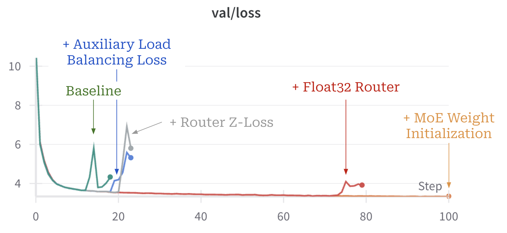

# nanoMoE


The simplest, fastest repository for training/finetuning medium-sized MoE-based GPTs.
This is a fork of [Andrej Karphathy](https://karpathy.ai/)'s [nanoGPT](https://github.com/karpathy/nanoGPT) repository, which is a simple but functional implementation of GPT-2 pretraining.
nanoMoE edits the functionality of nanoGPT to support training of both standard (decoder-only) LLMs and MoE-based architectures, including all necessary stability tricks for training MoEs (e.g., auxiliary losses, proper weight initialization, mixed precision, etc.).
See the related [blog post](cameronrwolfe.substack.com/p/nano-moe) for full details on nanoMoE. 



Most of the changes related to MoE functionality have been made in `model.py`, while `train.py` and other evaluation-related files are left largely unchanged.
We do include a manager for coordinating / storing the auxiliary losses of the MoE across multiple layers in `manager.py`.
The main configuration file for training nanoMoE is `config/train_nano_moe.py`.
Because the code is so simple, it is very easy to hack to your needs, train new models from scratch, or finetune pretrained checkpoints.

## install

```
pip install torch numpy transformers datasets tiktoken wandb tqdm
```

Dependencies:

- [pytorch](https://pytorch.org) <3
- [numpy](https://numpy.org/install/) <3
-  `transformers` for huggingface transformers <3 (to load GPT-2 checkpoints)
-  `datasets` for huggingface datasets <3 (if you want to download + preprocess OpenWebText)
-  `tiktoken` for OpenAI's fast BPE code <3
-  `wandb` for optional logging <3
-  `tqdm` for progress bars <3

## quick start

The [current configuration file](config/train_nano_moe.py) is created for a 2x3090 GPU on a single node.
The full pretraining script trains nanoMoE, a 6-layer MoE-based decoder-only transformer with 8 experts and 2 active experts, on ~25B tokens of the OpenWebText dataset in ~5 days.
If you have access to more GPUs, you can scale down `gradient_accumulation_steps` and scale up the `batch_size` accordingly.
You can also scale up `max_iters` to increase the number of tokens on which nanoMoE is trained.

#### Prepare OpenWebText

We first tokenize the dataset, in this case the [OpenWebText](https://openwebtext2.readthedocs.io/en/latest/), an open reproduction of OpenAI's (private) WebText used to train GPT-2:

```sh
python data/openwebtext/prepare.py
```

This downloads and tokenizes the [OpenWebText](https://huggingface.co/datasets/openwebtext) dataset. It will create a `train.bin` and `val.bin` which holds the GPT2 BPE token ids in one sequence, stored as raw uint16 bytes.

#### Run Pretraining

Then we're ready to kick off training. To reproduce nanoMoE, you'll want to run:

```sh
torchrun --standalone --nproc_per_node=2 train.py config/train_nano_moe.py
```

This will run for about 5 days using PyTorch Distributed Data Parallel (DDP) and go down to loss of ~3.35. Now, a GPT-2 model just evaluated on OWT gets a val loss of about 3.11, but if you finetune it it will come down to ~2.85 territory (due to an apparent domain gap). The slightly higher loss of nanoMoE is likely due to the fact that the model was made smaller to fit within a commodity (RTX 3090) GPU setup. 

If you're in a cluster environment and you are blessed with multiple GPU nodes you can make GPU go brrrr e.g. across 2 nodes like:

```sh
# Run on the first (master) node with example IP 123.456.123.456:
torchrun --nproc_per_node=8 --nnodes=2 --node_rank=0 --master_addr=123.456.123.456 --master_port=1234 train.py
# Run on the worker node:
torchrun --nproc_per_node=8 --nnodes=2 --node_rank=1 --master_addr=123.456.123.456 --master_port=1234 train.py
```

It is a good idea to benchmark your interconnect (e.g. iperf3). In particular, if you don't have Infiniband then also prepend `NCCL_IB_DISABLE=1` to the above launches. Your multinode training will work, but most likely _crawl_. By default checkpoints are periodically written to the `--out_dir`. We can sample from the model by simply `python sample.py`.

Finally, to train on a single GPU simply run the `python train.py` script. Have a look at all of its args, the script tries to be very readable, hackable and transparent. You'll most likely want to tune a number of those variables depending on your needs.

## baselines

OpenAI GPT-2 checkpoints allow us to get some baselines in place for openwebtext. We can get the numbers as follows:

```sh
$ python train.py config/eval_gpt2.py
$ python train.py config/eval_gpt2_medium.py
$ python train.py config/eval_gpt2_large.py
$ python train.py config/eval_gpt2_xl.py
```

and observe the following losses on train and val:

| model | params | train loss | val loss |
| ------| ------ | ---------- | -------- |
| gpt2 | 124M         | 3.11  | 3.12     |
| gpt2-medium | 350M  | 2.85  | 2.84     |
| gpt2-large | 774M   | 2.66  | 2.67     |
| gpt2-xl | 1558M     | 2.56  | 2.54     |

However, we have to note that GPT-2 was trained on (closed, never released) WebText, while OpenWebText is just a best-effort open reproduction of this dataset. This means there is a dataset domain gap. Indeed, taking the GPT-2 (124M) checkpoint and finetuning on OWT directly for a while reaches loss down to ~2.85. This then becomes the more appropriate baseline w.r.t. reproduction.

## finetuning

Finetuning is no different than training, we just make sure to initialize from a pretrained model and train with a smaller learning rate. 

## sampling / inference

Use the script `sample.py` to sample either from pre-trained GPT-2 models released by OpenAI, or from a model you trained yourself. For example, here is a way to sample from the largest available `gpt2-xl` model:

```sh
python sample.py \
    --init_from=gpt2-xl \
    --start="What is the answer to life, the universe, and everything?" \
    --num_samples=5 --max_new_tokens=100
```

If you'd like to sample from a model you trained, use the `--out_dir` to point the code appropriately. You can also prompt the model with some text from a file, e.g. ```python sample.py --start=FILE:prompt.txt```.

## troubleshooting

Note that by default this repo uses PyTorch 2.0 (i.e. `torch.compile`). This is fairly new and experimental, and not yet available on all platforms (e.g. Windows). If you're running into related error messages try to disable this by adding `--compile=False` flag. This will slow down the code but at least it will run.

For some context on this repository, GPT, and language modeling it might be helpful to watch Andrej's [Zero To Hero series](https://karpathy.ai/zero-to-hero.html). Specifically, the [GPT video](https://www.youtube.com/watch?v=kCc8FmEb1nY) is popular if you have some prior language modeling context. For context specifically on MoEs, check out the related [blog post](cameronrwolfe.substack.com/p/nano-moe) for this nanoMoE repository. 

For more questions/discussions feel free to stop by **#nanoGPT** on Discord:

[](https://discord.gg/3zy8kqD9Cp)

## acknowledgements

Thank you to Andrej Karpathy to providing an awesome [starting point](https://github.com/karpathy/nanoGPT) for the nanoMoE implementation!